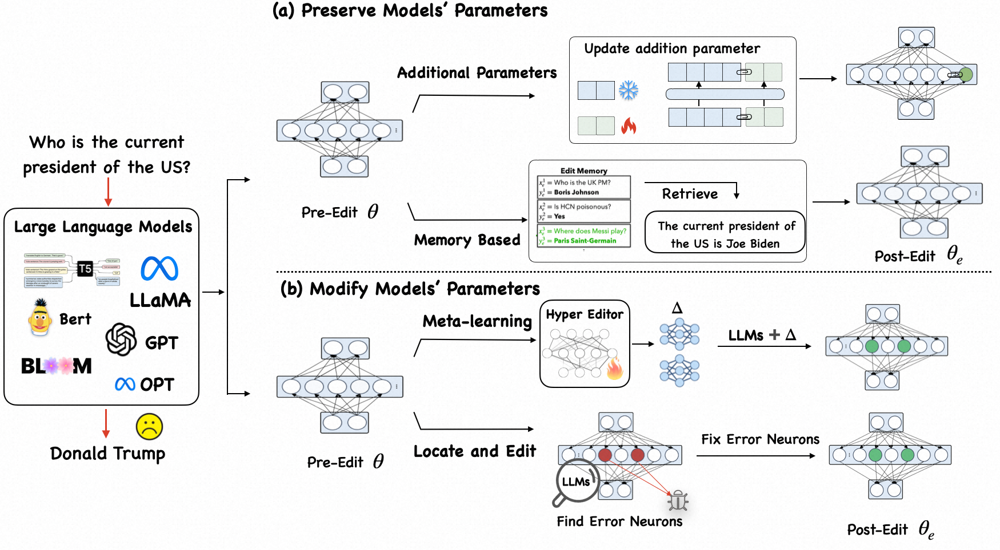

# Knowledge Editing for LLMs Papers

[](https://github.com/zjunlp/ModelEditingPapers) 
[](https://opensource.org/licenses/MIT)
 


Must-read papers on [knowledge editing](https://arxiv.org/abs/2305.13172) (model editing) for large language models.

## 🔔 News
- **2023-8-15 We release the paper "[EasyEdit: An Easy-to-use Knowledge Editing Framework for Large Language Models](https://arxiv.org/abs/2308.07269)."**
- **2023-07 We release [EasyEdit](https://github.com/zjunlp/EasyEdit), an easy-to-use knowledge editing framework for LLMs.**
- **2023-06 We will provide a tutorial on *Editing Large Language Models* at AACL 2023.**
- **2023-05  We release a new analysis paper:"[Editing Large Language Models: Problems, Methods, and Opportunities](https://arxiv.org/abs/2305.13172)" based on this repository! We are looking forward to any comments or discussions on this topic :)**
- **2022-12 We create this repository to maintain a paper list on *Knowledge Editing*.**

---

## 🔍 Contents

- [🌟 Why Knowledge Editing?](#-why-knowledge-editing)
- [Keywords](#keywords)
- [📜 Papers](#-papers)
  - [Overview](#overview)
  - [Methods](#methods)
    - [Preserve Parameters](#preserve-parameters)
      - [Memory Based](#memory-based)
      - [Additional Parameters](#additional-parameters)
    - [Modify Parameters](#modify-parameters)
      - [Finetuning](#finetuning)
      - [Meta-learning](#meta-learning)
      - [Locate and edit](#locate-and-edit)
    - [More Related Papers](#more-related-papers)
  - [Analysis](#analysis)
- [🧰 Resources](#-resources)
    - [Benchmarks and Tasks](#benchmarks-and-tasks)
    - [Tools](#tools)
- [🎉 Contribution](#contribution)
  - [Contributors](#contributors)
  - [Contributing to this paper list](#contributing-to-this-paper-list)
  - [Acknowledgement](#acknowledgement)
- [🚩Citation ](#-citation)

---

## 🌟 Why Knowledge Editing?
Knowledge Editing (or Model Editing) is a compelling field of research that focuses on facilitating efficient modifications to the behavior of models, particularly **foundation models**. The aim is to implement these changes within a specified scope of interest without negatively affecting the model's performance across a broader range of inputs.

### Keywords 
Knowledge Editing has strong connections with following topics.
- Updating and fixing bugs for large language models
- Language models as knowledge base, locating knowledge in large language models
- Lifelong learning, unlearning and etc.
- Security and privacy for large language models

## 📜 Papers
This is a collection of research and review papers of Knowledge Editing. Any suggestions and pull requests are welcome for better sharing of latest research progress.

### Overview
**Editing Large Language Models: Problems, Methods, and Opportunities**. [[paper](https://arxiv.org/abs/2305.13172)] 
<div align=center></div>

### Methods
#### Preserve Parameters

##### Memory-based

1. **Memory-Based Model Editing at Scale** (ICML 2022) <br />
 Eric Mitchell, Charles Lin, Antoine Bosselut, Christopher D. Manning, Chelsea Finn.
 [[paper](https://arxiv.org/abs/2206.06520)] [[code](https://github.com/eric-mitchell/serac)] [[demo](https://sites.google.com/view/serac-editing)]

2. **Fixing Model Bugs with Natural Language Patches**. (EMNLP 2022) <br />
Shikhar Murty, Christopher D. Manning, Scott M. Lundberg, Marco Túlio Ribeiro.
   [[paper](https://arxiv.org/abs/2211.03318)] [[code](https://github.com/MurtyShikhar/LanguagePatching)]
3. **MemPrompt: Memory-assisted Prompt Editing with User Feedback**. (EMNLP 2022) <br />
Aman Madaan, Niket Tandon, Peter Clark, Yiming Yang.
  [[paper](https://arxiv.org/abs/2201.06009)] [[code](https://github.com/madaan/memprompt)] [[page](https://memprompt.com/)] [[video](https://www.youtube.com/watch?v=Ld7R02bOiNQ&t=1s)]

4.  **Large Language Models with Controllable Working Memory**. <br />
 Daliang Li, Ankit Singh Rawat, Manzil Zaheer, Xin Wang, Michal Lukasik, Andreas Veit, Felix Yu, Sanjiv Kumar.
  [[paper](https://arxiv.org/abs/2211.05110)]

5. **Can We Edit Factual Knowledge by In-Context Learning?** <br />
Ce Zheng, Lei Li, Qingxiu Dong, Yuxuan Fan, Zhiyong Wu, Jingjing Xu, Baobao Chang.
[[paper](https://arxiv.org/abs/2305.12740)]
6. **Can LMs Learn New Entities from Descriptions? Challenges in Propagating Injected Knowledge** <br />
Yasumasa Onoe, Michael J.Q. Zhang, Shankar Padmanabhan, Greg Durrett, Eunsol Choi.
 [[paper](https://arxiv.org/abs/2305.01651)]
7. **MQUAKE: Assessing Knowledge Editing inLanguage Models via Multi-Hop Questions** <br>
Zexuan Zhong, Zhengxuan Wu, Christopher D. Manning, Christopher Potts, Danqi Chen.<br />
 .[[paper](https://arxiv.org/abs/2305.14795)]

##### Additional Parameters
1. **Calibrating Factual Knowledge in Pretrained Language Models**. (EMNLP 2022) <br />
Qingxiu Dong, Damai Dai, Yifan Song, Jingjing Xu, Zhifang Sui, Lei Li.
   [[paper](https://arxiv.org/abs/2210.03329)] [[code](https://github.com/dqxiu/CaliNet)]

2. **Transformer-Patcher: One Mistake worth One Neuron**. (ICLR 2023) <br />
Zeyu Huang, Yikang Shen, Xiaofeng Zhang, Jie Zhou, Wenge Rong, Zhang Xiong.
   [[paper](https://arxiv.org/abs/2301.09785)] [[code](https://github.com/ZeroYuHuang/Transformer-Patcher)]
3. **Aging with GRACE: Lifelong Model Editing with Discrete Key-Value Adaptors**. <br />
Thomas Hartvigsen, Swami Sankaranarayanan, Hamid Palangi, Yoon Kim, Marzyeh Ghassemi.
   [[paper](https://arxiv.org/abs/2211.11031)] [[code](https://github.com/thartvigsen/grace)]
4. **Neural Knowledge Bank for Pretrained Transformers** <br />
Damai Dai, Wenbin Jiang, Qingxiu Dong, Yajuan Lyu, Qiaoqiao She, Zhifang Sui. [[paper](http://arxiv.org/abs/2208.00399)]
##### Change LM's representation space

1. **Inspecting and Editing Knowledge Representations in Language Models** <br />
Evan Hernandez, Belinda Z. Li, Jacob Andreas.
  [[paper](http://arxiv.org/abs/2304.00740)] [[code](https://github.com/evandez/REMEDI)]


#### Modify Parameters
##### Finetuning
1. **Plug-and-Play Adaptation for Continuously-updated QA**. (ACL 2022 Findings) <br />
Kyungjae Lee, Wookje Han, Seung-won Hwang, Hwaran Lee, Joonsuk Park, Sang-Woo Lee.
 [[paper](https://arxiv.org/abs/2204.12785)] [[code](https://github.com/wookjeHan/Plug-and-Play-Adaptation-for-Continuously-updated-QA)]

2. **Modifying Memories in Transformer Models**. <br />
Chen Zhu, Ankit Singh Rawat, Manzil Zaheer, Srinadh Bhojanapalli, Daliang Li, Felix Yu, Sanjiv Kumar.
 [[paper](https://arxiv.org/abs/2012.00363)]

##### Meta-learning

1. **Editing Factual Knowledge in Language Models**. <br />
Nicola De Cao, Wilker Aziz, Ivan Titov.
 (EMNLP 2021) [[paper](https://arxiv.org/abs/2104.08164)] [[code](https://github.com/nicola-decao/KnowledgeEditor)]

2. **Fast Model Editing at Scale**. (ICLR 2022) <br />
Eric Mitchell, Charles Lin, Antoine Bosselut, Chelsea Finn, Christopher D. Manning.
 [[paper](https://arxiv.org/abs/2110.11309)] [[code](https://github.com/eric-mitchell/mend)] [[page](https://sites.google.com/view/mend-editing)]
3. **Editable Neural Networks**. (ICLR 2020) <br />
Anton Sinitsin, Vsevolod Plokhotnyuk, Dmitry V. Pyrkin, Sergei Popov, Artem Babenko.
[[paper](https://arxiv.org/abs/2004.00345)] [[code](https://github.com/xtinkt/editable)]
##### Locate and edit

1. **Editing a classifier by rewriting its prediction rules**. (NeurIPS 2021) <br />
Shibani Santurkar, Dimitris Tsipras, Mahalaxmi Elango, David Bau, Antonio Torralba, Aleksander Madry.
 [[paper](https://proceedings.neurips.cc/paper/2021/hash/c46489a2d5a9a9ecfc53b17610926ddd-Abstract.html)] [[code](https://github.com/MadryLab/EditingClassifiers)]

2. **Language Anisotropic Cross-Lingual Model Editing**. <br />
Yang Xu, Yutai Hou, Wanxiang Che.
 [[paper](https://arxiv.org/abs/2205.12677)] 

3. **Repairing Neural Networks by Leaving the Right Past Behind**. <br />
Ryutaro Tanno, Melanie F. Pradier, Aditya Nori, Yingzhen Li.
 [[paper](https://arxiv.org/abs/2207.04806)]

4. **Locating and Editing Factual Associations in GPT**. (NeurIPS 2022) <br />
Kevin Meng, David Bau, Alex Andonian, Yonatan Belinkov.
[[paper](https://arxiv.org/abs/2202.05262)] [[code](https://github.com/kmeng01/rome)] [[page](https://rome.baulab.info/)] [[video](https://www.youtube.com/watch?v=_NMQyOu2HTo&t=0)]

5. **Mass-Editing Memory in a Transformer**. <br />
Kevin Meng, Arnab Sen Sharma, Alex Andonian, Yonatan Belinkov, David Bau.
 [[paper](https://arxiv.org/abs/2210.07229)] [[code](https://github.com/kmeng01/memit)] [[page](https://memit.baulab.info/)] [[demo](https://memit.baulab.us/#/)]

6. **Editing models with task arithmetic** .<br />
Gabriel Ilharco, Marco Tulio Ribeiro, Mitchell Wortsman, Ludwig Schmidt, Hannaneh Hajishirzi, Ali Farhadi.
[[paper](https://openreview.net/pdf?id=6t0Kwf8-jrj)]

7. **Editing Commonsense Knowledge in GPT** .<br />
Anshita Gupta, Debanjan Mondal, Akshay Krishna Sheshadri, Wenlong Zhao, Xiang Lorraine Li, Sarah Wiegreffe, Niket Tandon.
[[paper](https://arxiv.org/abs/2305.14956)]

8. **Do Language Models Have Beliefs? Methods for Detecting, Updating, and Visualizing Model Beliefs**. <br />
Peter Hase, Mona Diab, Asli Celikyilmaz, Xian Li, Zornitsa Kozareva, Veselin Stoyanov, Mohit Bansal, Srinivasan Iyer.
  [[paper](https://arxiv.org/pdf/2111.13654.pdf)] [[code](https://github.com/peterbhase/SLAG-Belief-Updating)]

9. **Detecting Edit Failures In Large Language Models: An Improved Specificity Benchmark** .<br />
Jason Hoelscher-Obermaier, Julia Persson, Esben Kran, Ioannis Konstas, Fazl Barez.
[[paper](https://arxiv.org/abs/2305.17553)]

10. **Knowledge Neurons in Pretrained Transformers**.(ACL 2022) <br />
Damai Dai , Li Dong, Yaru Hao, Zhifang Sui, Baobao Chang, Furu Wei.[[paper](http://arxiv.org/abs/2104.08696)] [[code](https://github.com/Hunter-DDM/knowledge-neurons)] [[code by EleutherAI](https://github.com/EleutherAI/knowledge-neurons)]

11. **LEACE: Perfect linear concept erasure in closed form** .<br />
Nora Belrose, David Schneider-Joseph, Shauli Ravfogel, Ryan Cotterell, Edward Raff, Stella Biderman.
[[paper](https://arxiv.org/abs/2306.03819)]

12. **Transformer Feed-Forward Layers Are Key-Value Memories**. (EMNLP 2021) <br />
Mor Geva, Roei Schuster, Jonathan Berant, Omer Levy.  [[paper](https://arxiv.org/abs/2012.14913)]

13. **Transformer Feed-Forward Layers Build Predictions by Promoting Concepts in the Vocabulary Space**.(EMNLP 2022) <br />
Mor Geva, Avi Caciularu, Kevin Ro Wang, Yoav Goldberg. [[paper](https://arxiv.org/abs/2203.14680)]

14. **PMET: Precise Model Editing in a Transformer.**<br />
Xiaopeng Li, Shasha Li, Shezheng Song, Jing Yang, Jun Ma, Jie Yu. [[paper](https://arxiv.org/abs/2308.08742)] [[code](https://github.com/xpq-tech/PMET.git)] 
#### More Related Papers

1. **FRUIT: Faithfully Reflecting Updated Information in Text**. (NAACL 2022) <br />
Robert L. Logan IV, Alexandre Passos, Sameer Singh, Ming-Wei Chang.
 [[paper]()] [[code]()]

2. **Entailer: Answering Questions with Faithful and Truthful Chains of Reasoning**. (EMNLP 2022) <br />
Oyvind Tafjord, Bhavana Dalvi Mishra, Peter Clark.
 [[paper](https://arxiv.org/abs/2210.12217)] [[code](https://github.com/allenai/entailment_bank)] [[video](https://www.youtube.com/watch?v=GYTJ_Pxva7Q)]

3. **Towards Tracing Factual Knowledge in Language Models Back to the Training Data**. <br />
Ekin Akyürek, Tolga Bolukbasi, Frederick Liu, Binbin Xiong, Ian Tenney, Jacob Andreas, Kelvin Guu.
 (EMNLP 2022) [[paper](https://arxiv.org/abs/2204.12785)]

4. **Prompting GPT-3 To Be Reliable**. <br />
Chenglei Si, Zhe Gan, Zhengyuan Yang, Shuohang Wang, Jianfeng Wang, Jordan Boyd-Graber, Lijuan Wang.
 [[paper](https://arxiv.org/abs/2210.09150)]

5.  **Patching open-vocabulary models by interpolating weights**. (NeurIPS 2022) <br />
Gabriel Ilharco, Mitchell Wortsman, Samir Yitzhak Gadre, Shuran Song, Hannaneh Hajishirzi, Simon Kornblith, Ali Farhadi, Ludwig Schmidt.
  [[paper](https://arxiv.org/abs/2208.05592)] [[code](https://github.com/mlfoundations/patching)]

6. **Decouple knowledge from paramters for plug-and-play language modeling**  (ACL2023 Findings) <br />
Xin Cheng, Yankai Lin, Xiuying Chen, Dongyan Zhao, Rui Yan.[[paper](http://arxiv.org/abs/2305.11564)] [[code](https://github.com/Hannibal046/PlugLM)]

7. **Backpack Language Models** <br />
John Hewitt, John Thickstun, Christopher D. Manning, Percy Liang. [[paper](https://arxiv.org/pdf/2305.16765.pdf)]

8. **Learning to Model Editing Processes**. (EMNLP 2022) <br />
Machel Reid, Graham Neubig. [[paper](https://aclanthology.org/2022.findings-emnlp.280.pdf)]

### Analysis
1. **Does Localization Inform Editing? Surprising Differences in Causality-Based Localization vs. Knowledge Editing in Language Models.** <br />
Peter Hase, Mohit Bansal, Been Kim, Asma Ghandeharioun. [[paper](https://arxiv.org/pdf/2301.04213.pdf)] [[code](https://github.com/google/belief-localization)] 
2. **Dissecting Recall of Factual Associations in Auto-Regressive Language Models** <br />
Mor Geva, Jasmijn Bastings, Katja Filippova, Amir Globerson.  [[paper](https://arxiv.org/abs/2304.14767)]
3. **Evaluating the Ripple Effects of Knowledge Editing in Language Models** <br />
Roi Cohen, Eden Biran, Ori Yoran, Amir Globerson, Mor Geva. [[paper](https://arxiv.org/abs/2307.12976)]
4. **Edit at your own risk: evaluating the robustness of edited models to distribution shifts.** <br />
Davis Brown, Charles Godfrey, Cody Nizinski, Jonathan Tu, Henry Kvinge. [[paper](https://arxiv.org/abs/2303.00046)]
5. **Journey to the Center of the Knowledge Neurons: Discoveries of Language-Independent Knowledge Neurons and Degenerate Knowledge Neurons.** <br />
Yuheng Chen, Pengfei Cao, Yubo Chen, Kang Liu, Jun Zhao. [[paper](https://arxiv.org/abs/2308.13198)]
## 🧰 Resources

### Benchmarks and Tasks

|     Edit Type      | Benchmarks \& Datasets                                                  |
| :-----------------------: | ------------------------------------------------------------ |
| **Fact Knowledge**  | [ZSRE](https://github.com/nicola-decao/KnowledgeEditor), [CounterFact](https://rome.baulab.info/), [CounterFact+](https://arxiv.org/abs/2305.17553),[ECBD](https://github.com/yasumasaonoe/entity_knowledge_propagation) [MQUAKE](https://github.com/yasumasaonoe/entity_knowledge_propagation)  |
|  **Sentiment**   | [Convsent](https://arxiv.org/abs/2206.06520) |
|  **Bias**   | [Bias in Bios](https://arxiv.org/pdf/2304.00740.pdf) |
|  **Reasoning**   | [Eva-KELLM](https://arxiv.org/pdf/2308.09954.pdf) |
|  **Toxic Information**   | [RealToxicityPrompts](https://arxiv.org/abs/2009.11462) |
<!-- |   **Logical Reasoning**   | [ProofWriter](https://arxiv.org/abs/2012.13048), [EntailmentBank](https://arxiv.org/abs/2104.08661), [RuleTaker](https://www.ijcai.org/proceedings/2020/537), [CLUTRR](https://aclanthology.org/D19-1458/) |
| **Multimodal Reasoning**  | [SCIENCEQA](https://scienceqa.github.io/)                    |
|        **Others**         | [BIG-bench](https://doi.org/10.48550/arXiv.2206.04615), [SCAN](http://proceedings.mlr.press/v80/lake18a.html), [Chain-of-Thought Hub](https://arxiv.org/abs/2305.17306) | -->

### Tools
[EasyEdit](https://github.com/zjunlp/EasyEdit): An Easy-to-use Framework to Edit Large Language Models.

[FastEdit](https://github.com/hiyouga/FastEdit): Editing large language models within 10 seconds
## Citation

Please cite our paper if find our work useful.

```bibtex
@article{DBLP:journals/corr/abs-2305-13172,
  author       = {Yunzhi Yao and
                  Peng Wang and
                  Bozhong Tian and
                  Siyuan Cheng and
                  Zhoubo Li and
                  Shumin Deng and
                  Huajun Chen and
                  Ningyu Zhang},
  title        = {Editing Large Language Models: Problems, Methods, and Opportunities},
  journal      = {CoRR},
  volume       = {abs/2305.13172},
  year         = {2023},
  url          = {https://doi.org/10.48550/arXiv.2305.13172},
  doi          = {10.48550/arXiv.2305.13172},
  eprinttype    = {arXiv},
  eprint       = {2305.13172},
  timestamp    = {Tue, 30 May 2023 17:04:46 +0200},
  biburl       = {https://dblp.org/rec/journals/corr/abs-2305-13172.bib},
  bibsource    = {dblp computer science bibliography, https://dblp.org}
}
```
## 🎉Contribution
### Contributors

<a href="https://github.com/zjunlp/ModelEditingPapers/graphs/contributors">
  
</a>

### Contributing to this paper list
-  There are cases where we miss important works in this field, please contribute to this repo! Thanks for the efforts in advance.
### Acknowledgement
- We would like to express our gratitude to [Longhui Yu](https://yulonghui.github.io/) for the kind reminder about the missing papers.
